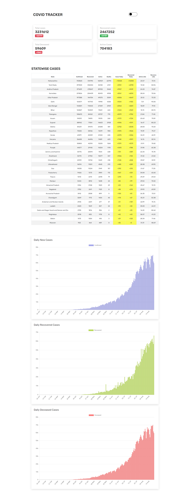
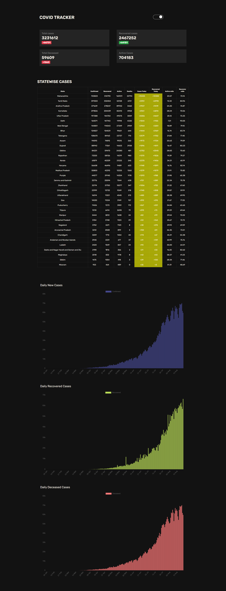

### Covid-19 Tracker
This project was bootstrapped with [Create React App](https://github.com/facebook/create-react-app).

## About

A Covid-19 tracker for India built using react JS, graphical representation of daily cases, recoveries and deceased was done
with Help of Chart.Js.

## How to use
 clone the repo and run npm install to install all the 
dependencies.

### `yarn start`

Runs the app in the development mode. 
Open [http://localhost:3000](http://localhost:3000) to view it in the browser.

The page will reload if you make edits. 
You will also see any lint errors in the console.

### `Demo Link `

 [Click here](https://cranky-lewin-2c43ae.netlify.app/) to launch the demo. :smiley:

